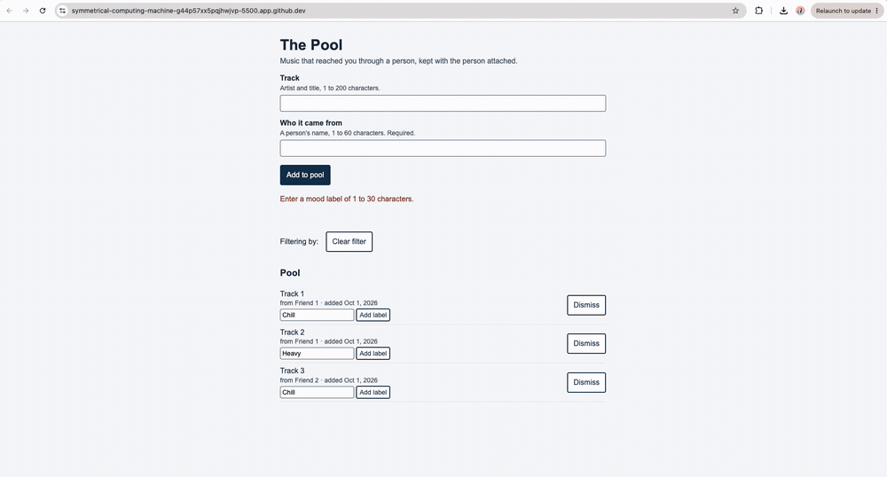
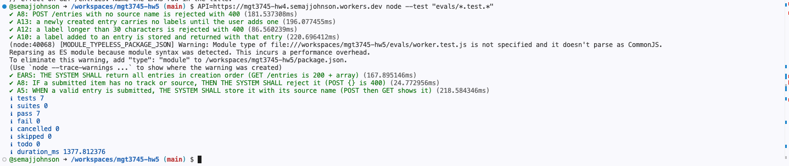

# The Pool


## What

The Pool is a place for music that reached you through a person, kept with the person attached — entries live in a Cloudflare D1 database behind a Worker, so the pool survives a cleared cache and appears in any browser. **This week's feature, mood and occasion labels with filtering (F4, acceptance rows A10–A14), was built by bolt.new from my context files and then integrated by hand.** Background: [PROJECT.md](context/PROJECT.md) for the problem, [FEATURES.md](context/FEATURES.md) for the specification, [EVALS.md](context/EVALS.md) for how it was checked, [TOOLS.md](context/TOOLS.md) for what crosses to whom. The HW4 version is at [mgt3745-hw4](https://github.com/semajjohnson/mgt3745-hw4).

## See It Work



Labelling an item, filtering by that label, and clearing the filter — acceptance rows A10, A11 and A14. The labels are stored in D1, not in the browser, which is the fix recorded in [DDR-001](docs/DDR-001.md).



## How to Run

**Deployed:** the Worker is live at [https://mgt3745-hw4.semajjohnson.workers.dev](https://mgt3745-hw4.semajjohnson.workers.dev). Open [`/entries`](https://mgt3745-hw4.semajjohnson.workers.dev/entries) to see the JSON the page consumes, each row carrying its labels.

To run the page:

1. Open this repository in a Codespace: **Code → Codespaces → Create codespace on main**.
2. Right-click `index.html` and choose **Open with Live Server**, or run `python3 -m http.server 5500` in the terminal.
3. Open port 5500 from the **Ports** tab.
4. Add a track and the name of the person it came from, then add a mood label to it.

To run the tests:

```bash
API=https://mgt3745-hw4.semajjohnson.workers.dev npm test
```

To see the failed-response path, add `?apiDown` to the page URL. To run the Worker locally, `npx wrangler d1 execute mgt3745-entries --local --file=schema.sql` then `npm run dev`, and point `apiBase` in `app.js` at `http://localhost:8787`.

## Status

| Area | State | Why |
|------|-------|-----|
| Code eval | 7 of 7 passing | [EVALS.md §5](context/EVALS.md) |
| Judgment eval | 9 of 12 agreement (75%) | Below the 80% threshold; a finding about my rubric, logged in [EVALS.md §4](context/EVALS.md) |
| Mood labels stored and displayed (A10) | Works | Stored in D1, verified by test |
| Filtering by label (A11) | Works, untested automatically | Human check only; the weakest row in my success criteria |
| Label length limit (A12) | Works | Server-side, verified by test |
| Only user-created labels (A13) | Works | Verified by test; the prediction I staked against |
| Active filter named and clearable (A14) | Works | Human check and judgment Q11 |
| Server 500 path | Cannot test yet | Open since HW4; cannot trigger an exception on a deployed Worker without shipping broken code |
| Two clients writing at once | Deferred | Single-user by design; see [ADR-002](context/ARCHITECTURE.md) |
| Automatic capture (A1–A4) | Deferred | No platform exposes shared-session events; see [ADR-001](context/ARCHITECTURE.md) |

## Links

Read in this order:

1. [`context/PROJECT.md`](context/PROJECT.md): the problem and its framing
2. [`context/USERS.md`](context/USERS.md): who this is for
3. [`context/FEATURES.md`](context/FEATURES.md): what it must do
4. [`context/ARCHITECTURE.md`](context/ARCHITECTURE.md): the gates, ADR-001 and ADR-002
5. [`context/STANDARDS.md`](context/STANDARDS.md): the rules this code follows
6. [`context/CLAUDE.md`](context/CLAUDE.md): the same rules, for agents
7. [`context/TOOLS.md`](context/TOOLS.md): every external service and what crosses to it
8. [`context/STYLE.md`](context/STYLE.md): design tokens, contrast ratios, and refusals
9. [`context/EVALS.md`](context/EVALS.md): the RAT, the stake and its resolution, the error log, the verification table
10. [`context/SKILLS.md`](context/SKILLS.md): one reusable pattern, one piece of delegation guidance

[SKILLS.md](context/SKILLS.md) and [EVALS.md](context/EVALS.md) retire their previews this week. [AGENTS.md](context/AGENTS.md) remains a preview until Module 6.

## Delegation

- [`docs/DDR-001.md`](docs/DDR-001.md): bolt.new built the mood-label feature. Six sections, five findings, one thing I could not verify.
- [`docs/DDR-002.md`](docs/DDR-002.md): the HW4 Worker and fetch layer, recorded properly after the fact.
- [`docs/COMPARISON.md`](docs/COMPARISON.md): the same spec given to bolt.new and Google AI Studio, and where they diverged.
- [`docs/JUDGMENT.md`](docs/JUDGMENT.md): twelve binary questions, two graders, 75% agreement and what that says about the rubric.
- [`delegated/bolt-001.zip`](delegated/bolt-001.zip): bolt's raw output, unmodified, for diffing against what I integrated.

## AI Use

Every delegation this week is recorded in the two DDRs above: what was sent, what came back, what I checked, and what I could not verify. The short version is that bolt.new followed every rule my context files stated, including the one I predicted it would break, and broke only rules my files never wrote down — new state went to `localStorage` because nothing said it could not.

**Actual hours on this assignment:** *(6)*